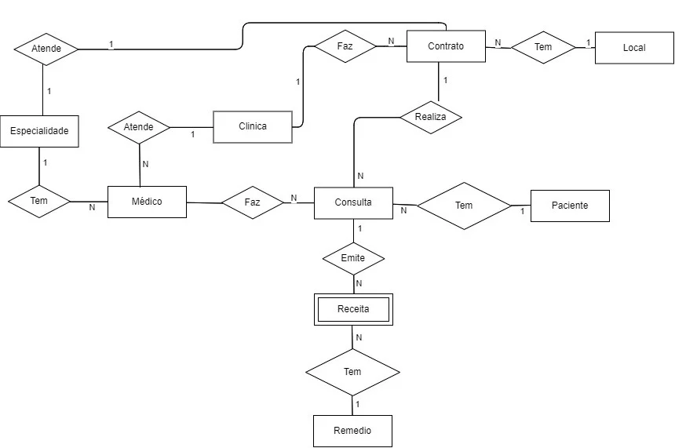

# Banco de Dados e Modelagem de Dados - Fundamentos

## **O que é banco de dados?**

Um banco de dados é um sistema de armazenamento de informações que permite a coleta, o armazenamento, a recuperação e a manipulação de dados de maneira estruturada e eficiente.

## Modelagem de dados

A modelagem de dados envolve a criação de modelos conceituais, lógicos e físicos que descrevem como os dados estão relacionados entre si e como são armazenados e acessados dentro de um sistema.

A modelagem de dados pode ser dividida em três etapas diferentes: 

1. modelagem conceitual;
2. modelagem logica e;
3. modelagem física.

---

## Modelagem Conceitual

A modelagem conceitual é a etapa inicial que foca na representação dos dados de forma abstrata, sem considerar detalhes técnicos de implementação.

Seus elementos principais são:

- Entidades
- Atributos
- Relacionamentos

O principal objetivo é capturar os requisitos do negócio de forma clara para todos os envolvidos, utilizando ferramentas como o Diagrama de Entidade-Relacionamento (DER).

---

## Modelagem Lógica

A modelagem lógica é a transformação do modelo conceitual em uma estrutura mais detalhada, definindo elementos como chaves primárias e estrangeiras, mantendo independência de plataforma.

Nesta etapa são estabelecidos:

- Definição de chaves primárias e estrangeiras
- Estabelecimento de restrições
- Normalização dos dados

O modelo resultante serve como guia para o desenvolvimento do banco de dados, sendo comumente representado através do Modelo de Dados Relacional.

## **Modelagem Física**

A modelagem física é o estágio final em que o modelo é implementado em um sistema específico de gerenciamento de banco de dados.

Nesta etapa, são definidos os tipos de dados, bem como detalhes de organização física, índices, particionamento e outros aspectos que afetam o desempenho.

O objetivo é otimizar o modelo para a plataforma escolhida e garantir que o banco de dados opere de forma eficiente.

A implementação é feita por meio de scripts de criação específicos para o sistema de gerenciamento de banco de dados selecionado.

---

## MER e DER

**ORM (Object-Relational Mapping, ou Mapeamento Objeto-Relacional)**

## MER (Modelo Entidade relacionamento)

Utilizamos para descrever os objetos do mundo real através de entidades, com suas propriedades que são os atributos e os seus relacionamentos.

Modelo conceitual.

### Atributos

Atributos são as características ou propriedades que descrevem uma entidade. Cada atributo representa uma informação específica que queremos armazenar sobre a entidade.

### Tipos de Atributos

- **Atributos Simples:** São atômicos e indivisíveis (exemplo: CPF, idade)
- **Atributos Compostos:** Podem ser divididos em subpartes menores (exemplo: endereço pode ser dividido em rua, número, CEP)
- **Atributos Multivalorados:** Podem ter múltiplos valores para uma mesma entidade (exemplo: telefones de contato)
- **Atributos Derivados:** São valores calculados a partir de outros atributos (exemplo: idade calculada a partir da data de nascimento)
- **Atributos Chave:** Identificam unicamente uma entidade (exemplo: CPF, número de matrícula)

Os atributos são fundamentais para definir as características específicas de cada entidade no modelo de dados, permitindo uma representação precisa das informações que precisam ser armazenadas.

## Tipos de relacionamentos

As entidades podem se relacionar entre si, havendo assim uma associação, que conhecemos como **relacionamento**, que normalmente são representados por verbos. Como, por exemplo, “uma pessoa trabalha para uma empresa”. Também podemos classificar os relacionamentos em três tipos:

- Relacionamento **UM PARA UM (1:1)**: Onde uma `entidade X` se associa unicamente a uma ocorrência da `entidade Y`.
- Relacionamento **UM PARA MUITOS (1:N)**: Onde uma `entidade X` se associa a várias ocorrências da `entidade Y`, porém, a `entidade Y` pode apenas se associar a uma ocorrência da `entidade X`.
- Relacionamento **MUITOS PARA MUITOS (N:N)**: Onde a `entidade X` o pode se associar a várias ocorrências da `entidade Y` e a `entidade Y` pode também se associar a várias ocorrências da `entidade X`.

## DER - Diagrama Entidade-Relacionamento

Usamos para representar de forma grafica o que foi descrito no MER.

Exemplos:

- Retângulos - Entidades
- bolas - Atributos
- Losango - Relacionamento

```mermaid
erDiagram
    LIVRO ||--o{ EMPRESTIMO : possui
    USUARIO ||--o{ EMPRESTIMO : realiza
    LIVRO {
        string ISBN
        string titulo
        string autor
        int ano_publicacao
        string editora
    }
    USUARIO {
        int id
        string nome
        string email
        string telefone
    }
    EMPRESTIMO {
        int id
        date data_emprestimo
        date data_devolucao
        string status
    }

```

Este diagrama de entidade-relacionamento (DER) representa um sistema simples de biblioteca onde:

- Um LIVRO pode ter vários EMPRESTIMOS (relacionamento 1:N)
- Um USUARIO pode realizar vários EMPRESTIMOS (relacionamento 1:N)
- Cada entidade possui seus atributos específicos que descrevem suas características

Os símbolos ||--o{ indicam a cardinalidade do relacionamento, onde || representa "um" e o{ representa "muitos".

Curso modelagem de dados - 23/05/2025

É importante organizar os dados e separar as informações para uma melhor visualização.

## Processo de construção do modelo conceitual.

O processo de construção do modelo conceitual começa com um levantamento detalhado de requisitos. Esta etapa é fundamental para entender as necessidades do negócio e identificar as informações que precisam ser representadas no banco de dados.

Durante o levantamento, é importante:

- Realizar entrevistas com stakeholders
- Analisar documentos existentes
- Identificar os principais processos de negócio
- Documentar todas as regras e restrições importantes

Com base nessas informações, pode-se então começar a criar diagramas e modelos que representem a estrutura dos dados de forma clara e organizada.

Em seguida, podemos criar o modelo conceitual

---
REFERÊNCIAS:
https://www.alura.com.br/artigos/modelagem-de- /n
https://www.alura.com.br/artigos/mer-e-der-funcoes
https://youtu.be/xN7B-_9YqAE?si=eYfY0BiqtqKAxJkg
https://youtu.be/W2Z1STnjNJo?si=hPZ7qU4ok9DlLoL_
